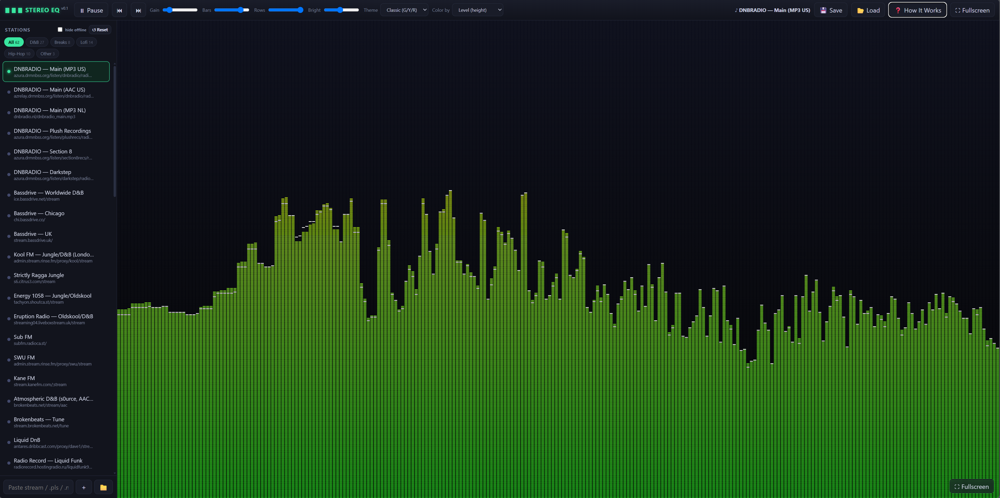

# BlueberryEQ — Streaming Spectrum Analyzer

A single-file, self-contained internet-radio player with a classic stereo-amp
**spectrum analyzer** visualizer. It streams the station itself and reads the
audio's frequency data directly in the browser — **no plugins, no loopback
cable, no install**. Just open `index.html`.

## Screenshot

<!-- Add a screenshot at docs/screenshot.png and it will appear here -->

## Live demo

If published with GitHub Pages, the app runs in your browser at:

**https://jrgruher.github.io/blueberryjoe-eq-visualizer/**

To enable it: repo **Settings → Pages → Source: `main` / root → Save**.

> ⚠️ **Mixed-content note:** the hosted demo is served over `https://`, so any
> station that streams over `http://` (e.g. Bassdrive and a few breaks stations)
> is blocked by the browser. The many `https://` stations work fine. To use
> **every** station, download `index.html` and open it locally — `file://` has
> no mixed-content restriction.

## Features

- 🎛️ Classic LED-style EQ bars with falling peak-hold caps
- 📻 70+ pre-loaded, CORS-verified stations (Drum & Bass, Breaks, Bass, Lofi, Hip-Hop)
- 🔎 Genre filter, search-as-you-add, `.pls` / `.m3u` import (drag & drop)
- 🎨 8 color themes + color-by-level or color-by-frequency
- 🎚️ Adjustable bars, rows, gain, brightness
- 🖥️ True fullscreen (auto-hiding controls)
- 💾 Settings + stations auto-save in the browser; export/import as JSON
- 🛟 Resilient playback: auto-retry, offline flagging, "hide offline" toggle

## Usage

1. Open `index.html` in a modern browser (Chrome/Edge recommended).
2. Pick a station and press **▶ Play** (browsers require one click before audio).
3. Press **F** or double-click the visualizer for fullscreen.

Keyboard: `Space` play/pause · `←` / `→` change station · `F` fullscreen.

## Adding stations

Paste a stream URL (or a `.pls` / `.m3u` URL) in the bottom box, drag a playlist
file onto the window, or use the 📁 button.

> Note: a station only drives the visualizer if its server allows cross-origin
> reads (CORS). All built-in stations are pre-verified. Some stations stream
> over `http://` and work when the file is opened locally; if the page is hosted
> over `https://`, browsers block mixed `http://` audio.

## Built-in stations (v0.2)

**Drum & Bass** — DNBRADIO (Main US/AAC/NL, Plush, Section 8, Darkstep),
Bassdrive (Worldwide, Chicago, UK), Kool FM, Strictly Ragga Jungle, Energy 1058,
Eruption Radio, Sub FM, SWU FM, Kane FM, Atmospheric D&B (s0urce), Brokenbeats,
Liquid DnB, Radio Record Liquid Funk, Dutch Delite, WSSR Sector Seven,
Back2Noize, NR1 DNB, DNB FM, Sky Plus DnB, Uturn, Infrared.fm, Meiji Drums,
Netil Radio, Rinse FM, RES, drumbase.space, Playback UK, Oldskool UK.

**Breaks** — DFM Breakbeat, RadioSpinner Atmospheric Breaks, 674FM, UPFront
Radio, Renegade Radio, NEU RADIO, ADRN Jungle & Breakbeat, Decibelia FM.

**Bass** — SomaFM Dub Step Beyond (256k/128k), Radio Record Future Bass,
Radio Record UK Garage, Uturn Dubstep, PulseEDM, ADRN UK Garage, dr_dick's dub
shack.

**Lofi / Downtempo** — Nightwave Plaza (OGG/MP3), Lofi 24/7, Hunter.FM Lo-Fi,
NIA Radio, BGMVibes, ISEKOI Chill Zone, Radio Record Lo-Fi, Radio Relax,
CalmFlow Chillstep, MonteCarlo Nights, hotmix LoFi, b3cks Radio, irvess.

**Hip-Hop / Rap / Funk** — FIP Hip Hop, WEFUNK, Radio Nova, KISS XTRA,
Urban Radio, GotRadio Hip Hop Stop, SUN Hip Hop, SUN Soul & Funk,
100% Hip Hop & RnB, KEXP Seattle.

*(Streams are operated by third parties and may go offline; the app flags
unavailable stations automatically.)*

## Sharing

It's one file — email `index.html`, or share it along with an exported
`eq-settings.json` (via the 💾 Save button) to include your station list.

## License

Licensed under **Creative Commons Attribution-NonCommercial 4.0**
(CC BY-NC 4.0). You may freely use, modify, and share this work for
**non-commercial** purposes, with attribution to the author.

**Commercial use is reserved.** If you want to use this in any product or
service that makes money, please contact the author for a commercial license
first. See [LICENSE](LICENSE) for details.

© 2026 Joe Gruher — github.com/jrgruher
